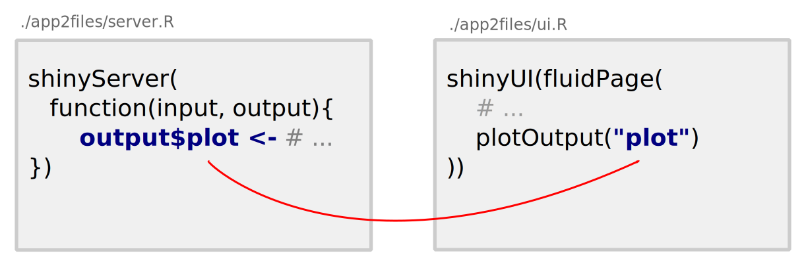
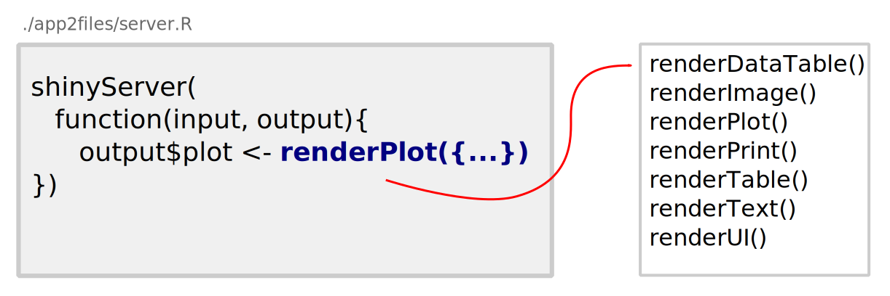
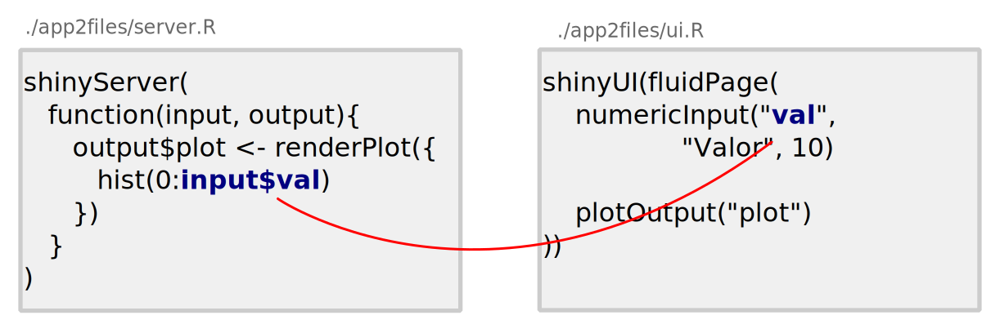

---
output:
  revealjs::revealjs_presentation:
    css: css/style.css
    theme: serif
    transition: slide
    center: false
    smart: false
    highlight: pygments
    incremental: false
    self_contained: false
    reveal_plugins:
      - zoom
      - menu
    reveal_options:
      slideNumber: true
      progress: true
---

```{r setup, include=FALSE}

library(knitr)
opts_chunk$set(
    warning = FALSE,
    message = FALSE,
    echo = TRUE,
    out.width = "100%",
    fig.align = "center",
    dev.args = list(family = "Palatino"))

```

## {class=center}

<h1>Uso do Shiny para o ensino-aprendizagem de Estatística Bayesiana</h1>

<div style="margin-bottom: 100px"></div>
<h3> Cristian Villegas\
Eduardo E. Ribeiro Jr\
Roseli A. Leandro
</h3>

## Autores

- **Cristian Villegas:** Doutor em Estatística pela USP (2010). Atualmente é
  professor doutor na ESALQ-USP e tem experiência na área de modelos
  simétricos e semi-paramétricos.

- **Eduardo E. Ribeiro Jr:** Bacharel em Estatística pela
  UFPR (2016). Atualmente é mestrando no PPG em Estatística e Experimentação na
  ESALQ-USP e tem experiência na área de modelos lineares generalizados
  e extensões.

- **Roseli A. Leandro:** Doutora em Estatística e Experimentação pela
  ESALQ-USP (1997). Atualmente é professora doutora na ESALQ-USP e tem
  experiência na área de inferência bayesiana.

## Disponibilização

- Desenvolvimento e códigos-fonte (dos apps e dos slides):\
  https://github.com/jreduardo/minicurso-bayes

- Webpage com os slides e os materiais:\
  http://www.leg.ufpr.br/~eduardojr/minicurso-bayes

- Pacote R com ferramentas para análise de cadeias MCMC:\
  http://github.com/jreduardo/mcmctools

## Motivação

- Aumento da utilização da inferência bayesiana para análise de dados
  por meio de modelos mais fidedignos a realidade;

- O melhor uso dos métodos disponíveis para inferência bayesiana
  dependem de um bom entendimento básico da área;

- Conceitos importantes de inferência bayesiana podem ser melhor
  ilustrados por meio de recursos interativos.

## Agenda

- **Parte I:** Introdução ao Shiny;

- **Parte II:** Conceitos de inferência bayesiana com Shiny;

- **Parte III:** Usando Shiny para diagnóstico de cadeias MCMC.

## {class=center data-background=#383D3D}

<h4 class="gray">Parte I</h4>
<h1 class="white">Introdução ao Shiny<h2>

## O que é o shiny?

### http://shiny.rstudio.com/

- **Produto do RStudio:**
    * Shiny server;
    * Shiny apps.

- **Pacote R:**
    * https://cran.r-project.org/package=shiny ;
    * https://github.com/rstudio/shiny/;

## {data-background-image="images/example.gif" data-background-size="80%"}

## {data-background-image="images/ideia1a.svg" data-background-size="80%"}

## {data-background-image="images/ideia1b.svg" data-background-size="80%"}

## {data-background-image="images/ideia1c.svg" data-background-size="80%"}

## Pra que serve o shiny?

<center>**Criar aplicativos web com códigos R!**</center>

Exemplos:

- Tornar suas análises interativas em aplicações web;
- Criar API's;
- Auxiliar no ensino-aprendizagem.
- http://shiny.rstudio.com/gallery/

## Como construir um Shiny app?

- Deve-se programar:
    * A interface para **inputs** do usuário;
    * As instruções que acessam os inputs e geram **outputs** para
      interface.

```{r echo=FALSE}

knitr::include_graphics("images/dificuldade.svg")

```

## {data-background-image="images/ideia2.svg" data-background-size="80%"}

## {data-background-image="images/tipos_apps.svg" data-background-size="80%"}

## {data-background-image="images/tipos_apps.svg" data-background-size="80%"}

## {data-background-image="images/plain0.svg" data-background-size="80%"}

## {data-background-image="images/plain1.svg" data-background-size="80%"}

## {data-background-image="images/plain2.svg" data-background-size="80%"}

## {data-background-image="images/plain3.svg" data-background-size="80%"}

## {data-background-image="images/plain4.svg" data-background-size="80%"}

## {data-background-image="images/plain5.svg" data-background-size="80%"}

## {data-background-image="images/plain6.svg" data-background-size="80%"}

## {data-background-image="images/plain7.svg" data-background-size="80%"}

## {data-background-image="images/plain8.svg" data-background-size="80%"}

## {data-background-image="images/plain9.svg" data-background-size="80%"}

## {data-background-image="images/plain10.svg" data-background-size="80%"}

## {data-background-image="images/plain11.svg" data-background-size="80%"}

## {data-background-image="images/plain12.svg" data-background-size="80%"}

## {data-background-image="images/plain13.svg" data-background-size="80%"}

## Regras para criação de apps com shiny

* Crie os **outputs**

```{r echo=FALSE}



```

## Regras para criação de apps com shiny

* Renderize os **outputs**

```{r echo=FALSE}



```

## Regras para criação de apps com shiny

* Acesse os **inputs**

```{r echo=FALSE}



```

## {data-background-image="images/shinyfunctions.svg" data-background-size="80%"}

## Para usuários do RStudio

```{r echo=FALSE}

knitr::include_graphics("images/rstudio.svg")

```

## Para usuários do RStudio

```{r echo=FALSE}

knitr::include_graphics("images/rstudio2.svg")

```

## Dicas gerais para programação de apps

1. Programe com um editor adequado;
    * Indentação;
    * Destaque de delimitadores.

1. Inspecione o erro;
    * As mensagens de erro são muito informativas;
    * Muitas vezes o erro é devido a ausência de vírgula ou parentêses.

1. Um passo de cada vez;
    * Comece com exemplos simples;
    * Aumente gradativamente a complexidade.

1. Consulte a documentação!

## {class=center data-background=#383D3D}

<h4 class="gray">Parte II</h4>
<h1 class="white">Conceitos de inferência bayesiana com Shiny<h2>

## Inferência bayesiana: conceitos básicos {class=mysmall}

**Referências originais**

- LII An essay towards solving a problem in the doctrine of chances.
  By the late Rev. Mr. Bayes, F. R. S. communicated by Mr. Price, in a
  letter to John Canton, A. M. F. R. S late Rev. Mr. Bayes, F. R. S.
- Bayes, Thomas; Price, Mr. (1763). "An Essay towards solving a Problem
  in the Doctrine of Chances". Philosophical Transactions of the Royal
  Society of London. 53 (0): 370–418. doi:10.1098/rstl.1763.0053.
- Barnard, G (1958). "Studies in the History of Probability and
  Statistics: IX. Thomas Bayes's An Essay Towards Solving a Problem in
  the Doctrine of Chances". Biometrika. 45 (3–4):
  296–315. doi:10.1093/biomet/45.3-4.293.
- Thomas Bayes "An Essay towards solving a Problem in the Doctrine of
  Chances". (Bayes' essay in the original notation)


## Inferência bayesiana: conceitos básicos {class=mysmall}

**Motivações**

- Richard Price e a existência de Deus;
- Richard Price descobriu o experimento de Thomas Bayes e seu, agora
  famoso, teorema em artigos depois de sua morte.
- Ele acreditava que o teorema de Bayes ajudaria a provar a existência
  de Deus.

**Primeira publicação em periódico científico**

- In 1662: The first volumes of what was the world's first scientific
  journal were very different from today's journal

<br>
<span class="myfoot"><a href=https://en.wikipedia.org/wiki/An_Essay_towards_solving_a_Problem_in_the_Doctrine_of_Chances>
Wikipedia: An Essay towards solving a Problem in the Doctrine of Chances
</a></span>
<span class="myfoot"><a href=http://rstl.royalsocietypublishing.org/>
Philosophical Transactions − the world's first science journal
</a></span>

## O resultado central do trabalho de Bayes

**Teorema de Bayes (teorema da probabilidade inversa)**

Se $H$ denota uma hipótese e $D$ denota os dados o teorema estabelece
que:

\[ P(H \mid D) = \dfrac{P(D \mid H)  \times  P(H)}{ P(D)}, \]

- com $P(H)$ representando o conhecimento sobre $H$ antes da observação
  dos dados; e
- $P(H \mid D)$ representando o conhecimento sobre $H$ atualizado pelos
dados.

## Inferência bayesiana

- O teorema de Bayes mostra como probabilidades mudam à luz de
  evidências: _dados_.

- Tendo especificado $P(D \mid H)$ e $P(H)$ o teorema fornece uma
  solução do problema de como **aprender através dos dados**.

## Inferência bayesiana

**Teorema de Bayes, no contexto de inferência estatística**

\[ \pi(\boldsymbol{\theta} \mid \boldsymbol{y}) =
   \dfrac{\mathcal{L}(\boldsymbol{\theta} \mid \boldsymbol{y})
      \pi(\boldsymbol{\theta})}{
      \int \mathcal{L}(\boldsymbol{\theta} \mid \boldsymbol{y})
      \pi(\boldsymbol{\theta})}
   \propto
   \mathcal{L}(\boldsymbol{\theta} \mid \boldsymbol{y})
   \pi(\boldsymbol{\theta}),
\]

em que,

- $\pi(\boldsymbol{\theta})$ é chamada de distribuição **_a priori_**;
- $\mathcal{L}(\boldsymbol{\theta} \mid \boldsymbol{y})$ é a função de
  **verossimilhança**; e
- $\pi(\boldsymbol{\theta} \mid \boldsymbol{y})$ é chamada de
  distribuição **_a posteriori_**.

## Inferência bayesiana

- Na aproximação bayesiana a incerteza relativa a quantidade
  desconhecida $\boldsymbol{\theta}$ é modelada e assim, como parte
  integrante do modelo uma distribuição _a priori_
  $\pi(\boldsymbol{\theta})$ é introduzida;

- Esta distribuição expressa o estado de conhecimento sobre o parâmetro
  $\boldsymbol{\theta}$ antes que os dados $\boldsymbol{y}$ sejam
  observados.

- Dado o conhecimento _a priori_ $\pi(\boldsymbol{\theta})$ e os dados
  $\boldsymbol{y}$, é possível calcular a distribuição de probabilidade
  de $\boldsymbol{\theta}$ após a observação de $\boldsymbol{y}$, a
  distribuição _a posteriori_ de $\boldsymbol{\theta}$, denotada por
  $\pi(\boldsymbol{\theta} \mid \boldsymbol{y})$.

## Função de verossimilhança

- A função de verossimilhança, $\mathcal{L}(\boldsymbol{\theta} \mid
  \boldsymbol{y})$, desempenha um papel muito importante na fórmula de
  Bayes.

- É por meio de $\mathcal{L}(\boldsymbol{\theta} \mid \boldsymbol{y})$
  que o conhecimento _a priori_ sobre $\boldsymbol{\theta}$ é
  atualizado;

- $\mathcal{L}(\boldsymbol{\theta} \mid \boldsymbol{y})$ pode ser vista
  como a representação do que os dados têm a nos contar a respeito do
  parâmetro $\boldsymbol{\theta}$.

## Distribuição _a priori_ {class=mysmall}

- A distribuição _a priori_, $\pi(\boldsymbol{\theta})$ que representa o
  que é conhecido a respeito dos parâmetros desconhecidos **antes que os
  dados sejam observados**, desempenha um importante papel na inferência
  bayesiana.

- $\pi(\boldsymbol{\theta})$ pode ser utilizada para representar
  conhecimento prévio ou ignorância relativa.

- Classificações e interpretação (diferentes autores com diferentes
  definições):
    * Objetivas, subjetivas;
    * Informativas, não-informativas;
    * Vagas;
    * De referência.

## Inferência bayesiana

- Do ponto de vista bayesiano, toda inferência a respeito do parâmetro
  está baseada na distribuição _a posteriori_, ou seja,

- Dada a verossimilhança $\mathcal{L}(\boldsymbol{\theta} \mid
  \boldsymbol{y})$ e a distribuição _a priori_
  $\pi(\boldsymbol{\theta})$, o início de qualquer inferência
  paramétrica ou decisão sobre $\boldsymbol{\theta}$ está na densidade
  _a posteriori_:

## Exemplo com a distribuição binomial {class=mysmall}

Sejam $\boldsymbol{y} = \{y_{1}, y_{2}, \ldots, y_{n}\}$ uma amostra
aleatória de uma distribuição binomial com parâmetro $\theta$,

- a função massa de probabilidade é dada por

\[ f(y_i \mid \theta) = {m \choose y_i} \theta^{y_i}
   (1-\theta)^{m-y_i},
   \quad y_i \in \{ 0, 1, 2, \ldots, m\};
\]

- e a função de verossimilhança por

\[
  \begin{aligned}
  \mathcal{L}(\theta \mid \boldsymbol{y}) &=
    \prod_{i=1}^{n} {m \choose y_i}
    \theta^{y_i} (1-\theta)^{n-y_i} \\
  &= \theta^{\sum_i^n y_i}  (1-\theta)^{n-\sum_i^n y_i}
    \prod_{i=1}^n {m \choose y_i}, \quad \theta  \in [0,1].
  \end{aligned}
\]

## Exemplo com a distribuição binomial {class=mysmall}

- Considerando-se a distribuição _a priori_ conjugada para $\theta$,

\[ \pi(\theta) = \dfrac{\Gamma(\alpha+\beta)}{\Gamma(\alpha)
   \Gamma(\beta)} \theta^{\alpha-1}(1-\theta)^{\beta-1},
   \alpha > 0, \beta > 0.
\]

- A distribuição _a posteriori_ é obtida analiticamente,

\[
  \begin{gathered}
  \pi(\theta \mid \boldsymbol{y}) \propto
    \mathcal{L}(\theta \mid \boldsymbol{y}) \pi(\theta) =
    \theta^{\sum_i^{n} y_i + \alpha - 1}
    (1 - \theta)^{nm-\sum_i^n y_i + \beta -1} \\
    \theta \mid \boldsymbol{y} \sim \text{Beta} \left(
      \sum_i^{n} y_i + \alpha,\; nm - \sum_{i=1}^n y_i + \beta
    \right)
  \end{gathered}
\]

## Exemplo com a distribuição binomial {class=mysmall}

- A distribuição preditiva

\[
  \begin{aligned}
  f(\tilde{y} \mid \boldsymbol{y}) &= \int_{\mathcal{R}}
    f(\tilde{y} \mid \theta) \pi(\theta \mid \boldsymbol{y}) =\\
  &= \int_0^1 {\tilde{m} \choose \tilde{y}} \theta^{\tilde{y}}
    (1-\theta)^{ \tilde{m}-\tilde{y} }  \theta^{\sum_i^{n} y_i +
    \alpha -1}(1 - \theta)^{nm-\sum_i^n y_i + \beta -1} d \theta,\\
  &\tilde{y} \in \{ 0, 1, 2, \ldots, \tilde{m}\}.
  \end{aligned}
\]

e portanto,
\[
  \tilde{y} \mid \boldsymbol{y} \sim \text{Beta-Binomial}(
  \tilde{m},\; \sum_{i=1}^n y_i + \alpha,\; nm-\sum_i^n y_i + \beta).
\]

## Exemplo com a distribuição Poisson {class=mysmall}

Sejam $\boldsymbol{y}=\{y_{1}, y_{2}, \ldots, y_{n}\}$ uma amostra
aleatória de uma distribuição de Poisson com parâmetro $\theta$,

- a função massa de probabilidade é dada por

\[ f(y_{i} \mid \theta) = \dfrac{e^{-\theta} \theta^{y_i}}{y_i!},
   \quad y_{i}= 0, 1, 2, \ldots;
\]

- e a função de verossimilhança por

\[
  \mathcal{L}(\theta \mid \boldsymbol{y}) =
    \prod_{i=1}^{n} \dfrac{e^{-\theta} \theta^{y_i}}{y_i!}
  = \dfrac{e^{-n \theta} \theta^{\sum_{i=1}^{n} y_i}}{
    \prod_{i=1}^{n}y_{i}!},\quad \theta >0.
\]

## Exemplo com a distribuição Poisson {class=mysmall}

- Considerando-se a distribuição _a priori_ conjugada para $\theta$,

\[ \pi(\theta) = \dfrac{\beta^\alpha}{ \Gamma(\alpha)}\theta^{\alpha-1}
   e^{-\beta \theta}.
\]

- A distribuição _a posteriori_ é obtida analiticamente,

\[
  \begin{aligned}
  \pi(\theta \mid \boldsymbol{y}) &= \dfrac{
    \mathcal{L}(\theta \mid \boldsymbol{y}) \pi(\theta)}{
    \int_{0}^{\infty}\pi(\theta) \mathcal{L}(\theta \mid \boldsymbol{y})
    \pi(\theta) d \theta },\\
    &= \dfrac{(n+\beta)^{\alpha + n \bar{y} } \theta^{\alpha+n \bar{y}-1}
    e^{-(n+\beta) \theta}}{\Gamma(\alpha + n \bar{y} )},\\
    \theta \mid \boldsymbol{y}&\; \sim
    \text{Gamma}(\alpha+n \bar{y},\; n + \beta)
  \end{aligned}
\]

## Exemplo com a distribuição Poisson {class=mysmall}

Observe que, desprezando-se a constante normalizadora, o kernel da
distribuição a posteriori é dado por:

\[  \theta^{\alpha+n \bar{y}-1} ~ e^{-(n+\beta), \theta}  \]

que representa o kernel de uma distribuição gama com parâmetro de forma,
$\alpha+n \bar{y}$ e parâmetro de taxa , $n + \beta$.

Ou seja, desprezando-se a constante normalizadora, chega-se a mesma
conclusão.

## Exemplo com a distribuição Poisson {class=mysmall}

- A distribuição preditiva, para $\tilde{y} = 0, 1, \ldots$

\[
  \begin{aligned}
  f(\tilde{y} \mid \boldsymbol{y}) &= \int_{\mathcal{R}}
    f(\tilde{y} \mid \theta) \pi(\theta \mid \boldsymbol{y}) =\\
  &= \int_{0}^{\infty} \dfrac{e^{-\theta}\theta^{\tilde{y}}}{\tilde{y}!}
    \dfrac{\tilde{\beta}^{\tilde{\alpha}}}{\Gamma(\tilde{\alpha})}
    \theta^{\tilde{\alpha}-1}  e^{-\tilde{\beta} \theta} d\theta\\
  &= \dfrac{\tilde{\beta}^{\tilde{\alpha}}}{\Gamma(\tilde{\alpha})
    \tilde{y}!} \dfrac{\Gamma(\tilde{\alpha}+\tilde{y})
    \Gamma(\tilde{\beta}+1)}{\Gamma(\tilde{\alpha}+\tilde{y} +
    \tilde{\beta}+1)}
  \end{aligned}
\]

considerando-se $\tilde{\alpha}=\alpha+n \bar{y}$ e $\tilde{\beta} =
n+\beta$.

## Algoritmo Metropolis-Hastings

- Quando a distribuição a posteriori possuir uma expressão complexa, a
  obtenção de resumos a posteriori pode não ser simples;

- Uma forma bastante utilizada na inferência bayesiana para superar essa
  dificuldade é gerar uma cadeia de Markov cuja distribuição de
  equilíbrio seja a distribuição de interesse, e assim os resumos a
  posteriori serão calculados por meio da amostra obtida (_sampling
  based_)

- Um algoritmo bastante utilizado é o algoritmo de Metropolis-Hastings.

## Algoritmo Metropolis-Hastings (versão 1)

Seja $\pi(\theta \mid y)$ a distribuição alvo (_target distribution_) e
$\theta^{(t)}$ o valor amostral atual de $\pi(\theta\mid y)$. O algoritmo
Metropolis-Hastings desenvolve-se da seguinte maneira:

1. Propõe um $\theta^{*} \sim g(\theta \mid \theta^{t})$;
2. Aceita $\theta^{t+1} = \theta^{*}$ com probabilidade $\min\{1,r\}$ em
   que:

   \[ r = r(\theta ^{t}, \theta^{*}) =
      \dfrac{\pi(\theta^{*}\mid y) \;/\; g(\theta^{*} \mid \theta^{t})}{
      \pi(\theta^{t} \mid y) \;/\; g(\theta^{t} \mid \theta^{*}) }
   \]

3. Caso contrário, faz $\theta^{t+1} = \theta^{t}$

## Algoritmo Metropolis-Hastings (versão 2)

Seja $\pi(\theta \mid y)$ a distribuição alvo (_target distribution_) e
$\theta^{(t)}$ o valor amostral atual de $\pi(\theta\mid y)$. O algoritmo
Metropolis-Hastings desenvolve-se da seguinte maneira:

1. Propõe um $\theta^{*} \sim g(\theta)$;
2. Aceita $\theta^{t+1} = \theta^{*}$ com probabilidade $\min\{1,r\}$ em
   que:

   \[ r = r(\theta ^{t}, \theta^{*}) =
      \dfrac{\pi(\theta^{*}\mid y) \;/\; g(\theta^{*})}{
      \pi(\theta^{t} \mid y) \;/\; g(\theta^{t}) }
   \]

3. Caso contrário, faz $\theta^{t+1} = \theta^{t}$

## Algoritmo Metropolis-Hastings (versão 3)

Seja $\pi(\theta \mid y) = k q(\theta \mid y)$ a distribuição alvo
(_target distribution_) e $\theta^{(t)}$ o valor amostral atual de
$\pi(\theta\mid y)$. O algoritmo Metropolis-Hastings desenvolve-se da
seguinte maneira:

1. Propõe um $\theta^{*} \sim g(\theta \mid \theta^{t})$;
2. Aceita $\theta^{t+1} = \theta^{*}$ com probabilidade $\min\{1,r\}$ em
   que:

   \[ r = r(\theta ^{t}, \theta^{*}) =
      \dfrac{q(\theta^{*}\mid y) \;/\; g(\theta^{*}\mid \theta^{t})}{
      q(\theta^{t} \mid y) \;/\; g(\theta^{t}\mid \theta^{*}) }
   \]

3. Caso contrário, faz $\theta^{t+1} = \theta^{t}$

## Algoritmo Metropolis-Hastings (versão 4)

Seja $\pi(\theta \mid y) = k q(\theta \mid y)$ a distribuição alvo
(_target distribution_) e $\theta^{(t)}$ o valor amostral atual de
$\pi(\theta\mid y)$. O algoritmo Metropolis-Hastings desenvolve-se da
seguinte maneira:

1. Propõe um $\theta^{*} \sim g(\theta)$;
2. Aceita $\theta^{t+1} = \theta^{*}$ com probabilidade $\min\{1,r\}$ em
   que:

   \[ r = r(\theta ^{t}, \theta^{*}) =
      \dfrac{q(\theta^{*}\mid y) \;/\; g(\theta^{*})}{
      q(\theta^{t} \mid y) \;/\; g(\theta^{t}) }
   \]

3. Caso contrário, faz $\theta^{t+1} = \theta^{t}$

## {class=center data-background=#383D3D}

<h4 class="gray">Parte III</h4>
<h1 class="white">Usando Shiny para diagnóstico de cadeias MCMC<h2>

## O uso de MCMC para inferência bayesiana

## Inferência bayesiana via MCMC (Softwares)

- Pacotes que são interfaces para programas _standalone_:
    - **rstan** (para o STAN);
    - **rjags**/**R2jags** (para o JAGS);
    - **R2OpenBUGS**/**rbugs** (para o OpenBUGS);
    - **R2WinBUGS** (para o WinBUGS).

- Pacotes R
    - **mcmc**;
    - **MCMCpack**;
    - **LaplacesDemon**.

## Pacote **mcmctools**

**Ferramentas utéis para manipulação de objetos MCMC**

```{r eval=FALSE}

# install.packages("devtools")
install_github("jreduardo/mcmctools")
help(package = "mcmctools", help_type = "html")

```

Funções:

- `mcmctools::mct_select`
- `mcmctools::mct_burnin`
- `mcmctools::mct_thin`
- `mcmctools::mct_merge`
- **`mcmctools::mct_shinyapp`**

## Exemplo de uso
